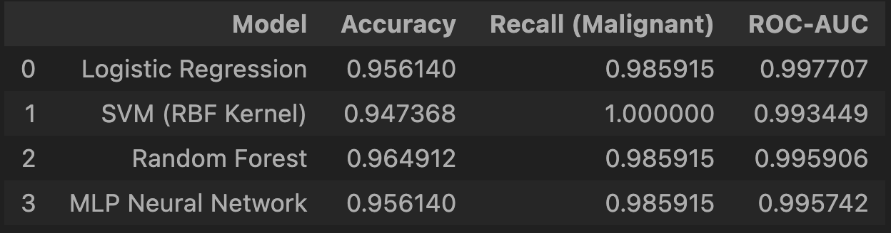
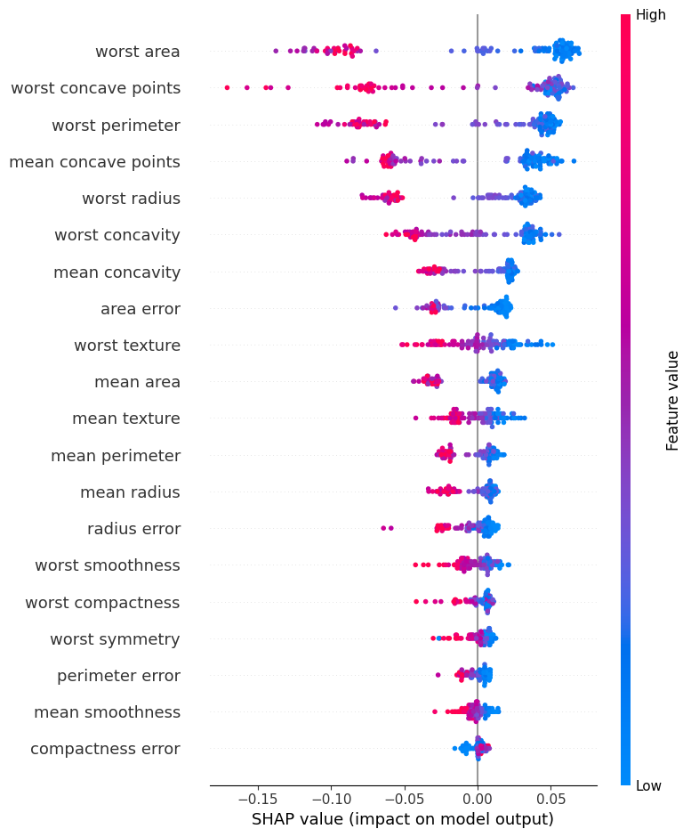

# breast-cancer-diagnostic-model
Machine learning–based classification of breast tumor samples using clinically relevant diagnostic features.

---

## Project Overview

This project investigates the use of machine learning models for classifying breast tumor samples as **malignant** or **benign** based on structured clinical features extracted from medical imaging data.  

The primary goal is not only to achieve high predictive performance, but to evaluate models through a **clinical lens**, where interpretability, robustness, and minimizing life-threatening errors are critical.

This work was developed as a self-initiated research project to gain hands-on experience at the intersection of **machine learning, statistics, and healthcare diagnostics**.

---

## Dataset

The models are trained and evaluated using the **Breast Cancer Wisconsin (Diagnostic)** dataset, accessed via `scikit-learn`.

- **Total samples:** 569  
- **Number of features:** 30  
- **Target classes:**  
  - `0` → Malignant  
  - `1` → Benign  

Each sample consists of measurements computed from digitized images of **fine needle aspirate (FNA)** of breast masses.

Representative features include:
- Mean tumor radius  
- Texture and smoothness  
- Concavity and concave points  
- Perimeter and area statistics  

This dataset is widely used as a benchmark for binary classification in medical machine learning research.

---

## Methodology

The analysis follows a structured and reproducible workflow:

1. Dataset loading and inspection  
2. Exploratory data analysis  
3. Train–test split with stratification  
4. Model training and hyperparameter selection  
5. Performance evaluation using multiple metrics  
6. Cross-validation to ensure robustness  
7. Visualization of diagnostic performance  

Initial experimentation focused on **Logistic Regression** due to its interpretability, followed by a comparative study with more complex models.

---

## ROC Curve Analysis (Cross-Validated)

The Receiver Operating Characteristic (ROC) curve illustrates the model’s ability to distinguish between malignant and benign tumors across classification thresholds.

To ensure reliability, the ROC-AUC score was computed using **5-fold stratified cross-validation**, preserving class balance across folds.

- **Mean ROC-AUC:** 0.9917  

This indicates strong separability between the two classes.

---

## Comparative Model Analysis

Multiple machine learning models were evaluated using **identical data splits and evaluation metrics**:

- Logistic Regression  
- Support Vector Machine (RBF Kernel)  
- Random Forest  
- Multi-Layer Perceptron (Neural Network)

### SHAP Feature Importance (Random Forest)

SHAP (SHapley Additive exPlanations) was used to interpret the Random Forest
model by quantifying the contribution of each feature to malignant
predictions. The summary plot highlights clinically relevant features such
as concavity, radius, and texture as dominant drivers of malignancy
classification.

### Key Findings

While **Random Forest** achieved the highest overall accuracy, the **SVM model achieved perfect recall (100%) for malignant cases**.

In clinical diagnostics:
- A **False Negative** (malignant predicted as benign) can delay or prevent life-saving treatment  
- A **False Positive** may lead to additional tests, which is comparatively less dangerous  

For this reason, **recall for malignant cases was prioritized over raw accuracy**.

**Conclusion:**  
From a clinical risk perspective, the **Support Vector Machine** emerges as the most reliable diagnostic model in this study.

---

## Example Prediction

The trained models support predictions on unseen patient data by returning:
- A predicted class label (Malignant / Benign)  
- A probability score reflecting model confidence  

A synthetic patient example is included in the notebook to demonstrate the full prediction pipeline.

---

## Limitations

- The dataset is a benchmark dataset and does not reflect real hospital deployment data  
- No external validation cohort was used  
- Feature extraction is predefined and not learned from raw images  
- This project is intended for **educational and research purposes only**  
- The models must **not** be used for real medical diagnosis  

---

## Future Work

Planned improvements include:
- Explainable AI analysis using SHAP or LIME  
- Feature-to-clinical interpretation mapping  
- Evaluation on additional open medical datasets (CSV format)  
- Ensemble modeling and threshold optimization  
- Improved documentation aligned with scientific manuscripts  

---

## Technologies Used

- Python  
- NumPy  
- Pandas  
- Matplotlib  
- Scikit-learn  
- Jupyter Notebook  

---

## Author Notes

This repository reflects an evolving understanding of applied machine learning in medical contexts.  
Future updates will focus on **interpretability, clinical relevance, and research-grade evaluation practices**.
